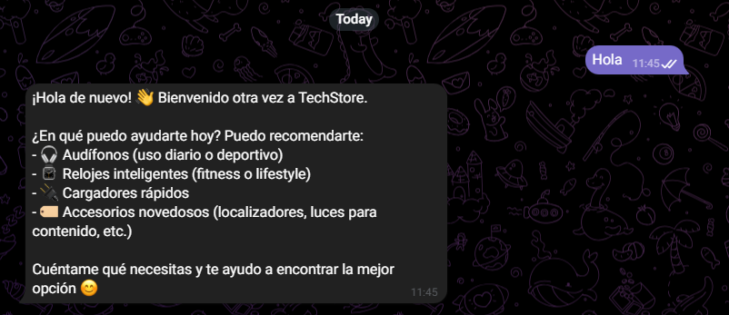
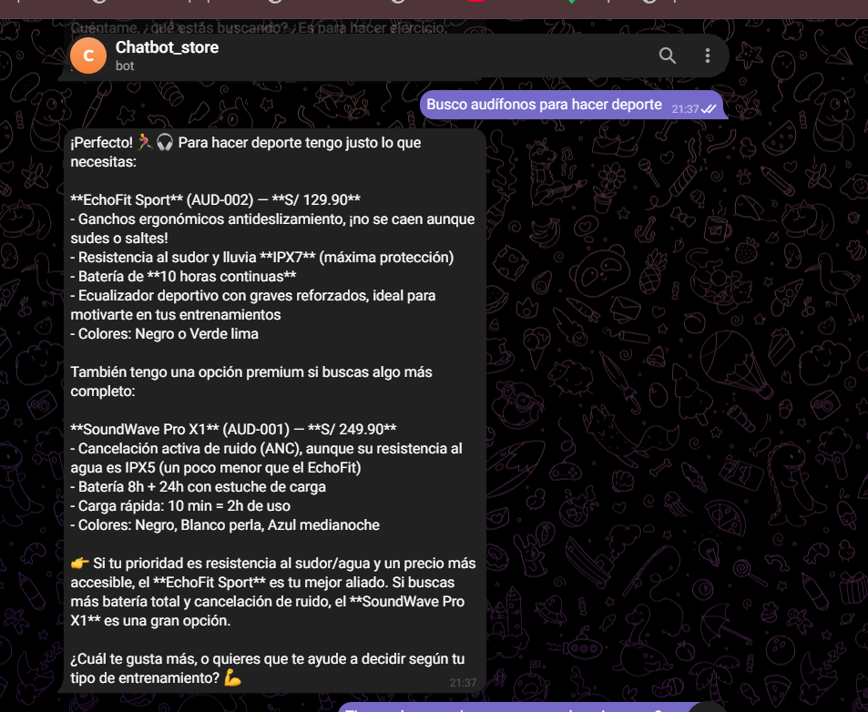
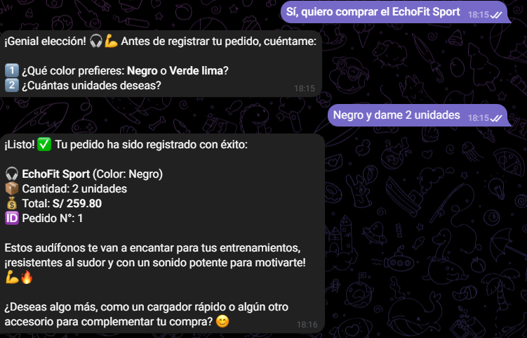

# TechStore Bot 🤖🛍️

Chatbot de venta de productos tecnológicos (audífonos, relojes inteligentes, cargadores y
accesorios novedosos) integrado con **Telegram** y potenciado por la **API de Claude (Anthropic)**.

## Arquitectura

```
Usuario (Telegram)
      │
      ▼
Telegram Bot API  ──►  app/bot.py (python-telegram-bot)
                              │
                              ▼
                    app/services/claude_client.py
                     - arma contexto (RAG por keywords)
                     - llama a Claude con tool use
                              │
              ┌───────────────┼───────────────┐
              ▼                               ▼
   app/services/catalogo.py         app/services/db.py
   (catalogo.json - fuente          (SQLite: mensajes y pedidos,
    de productos)                    usando app/models.py)
```

## Estructura del proyecto

```
TechStoreBot/
├── app/
│   ├── bot.py                  # Punto de entrada: handlers de Telegram
│   ├── config.py               # Configuración centralizada (variables de entorno)
│   ├── models.py               # Modelos de datos (SQLAlchemy: Mensaje, Pedido)
│   ├── data/
│   │   └── catalogo.json       # Catálogo de productos (fuente del RAG)
│   └── services/
│       ├── catalogo.py         # Lógica: carga y búsqueda (retriever) del catálogo
│       ├── claude_client.py    # Lógica: orquestación del LLM (RAG + tool use)
│       └── db.py                # Lógica: acceso a la base de datos (repositorio)
├── tests/
│   ├── conftest.py             # Fixtures: BD SQLite temporal para pruebas
│   ├── test_catalogo.py        # Pruebas del retriever
│   ├── test_db.py              # Pruebas de persistencia
│   └── test_claude_client.py   # Pruebas de la tool registrar_pedido
├── .env.example                 # Plantilla de variables de entorno
├── requirements.txt             # Dependencias de producción
├── requirements-dev.txt         # Dependencias de desarrollo (pytest)
└── README.md
```

## Requisitos

- Python 3.10+
- Token de bot de Telegram (vía [@BotFather](https://t.me/BotFather))
- API Key de Anthropic (https://console.anthropic.com/)

## Instalación

```bash
cd TechStoreBot
python -m venv venv
venv\Scripts\activate        # Windows
pip install -r requirements.txt
cp .env.example .env
# Editar .env con tu TELEGRAM_BOT_TOKEN y ANTHROPIC_API_KEY
```

## Ejecución

```bash
python -m app.bot
```

Luego abre tu bot en Telegram y envía `/start`.

## Cómo probarlo (flujo sugerido para la demo)

1. `/start` → mensaje de bienvenida.
2. "Busco audífonos para hacer deporte" → recomienda EchoFit Sport.
3. "¿Tienen algo novedoso para no perder mis cosas?" → recomienda AirTrack Tag.
4. "Quiero comprar el PulseFit Watch 5" → el bot confirma y registra el pedido (usa la
   herramienta `registrar_pedido`, que queda guardado en `app/data/pedidos.db`).

## Pruebas

```bash
pip install -r requirements-dev.txt
pytest -v
```

Las pruebas usan una base de datos SQLite temporal (no tocan `app/data/pedidos.db`) y no llaman a la
API de Claude: cubren el retriever del catálogo (`app/services/catalogo.py`), la persistencia
(`app/services/db.py`) y la lógica de la tool `registrar_pedido`.

## Capturas

| Bienvenida | Recomendación según necesidad | Registro de pedido |
|---|---|---|
|  |  |  |

El bot pregunta color y cantidad antes de confirmar, valida el producto contra el catálogo real y calcula el
total — flujo completo: recomendación → aclaración de color/cantidad → pedido registrado con ID.

## Alcance (qué SÍ y qué NO hace)

**Sí hace:**
- Recomienda productos del catálogo según necesidad expresada en lenguaje natural.
- Responde preguntas sobre precio, stock, características y colores.
- Registra pedidos confirmados en base de datos.
- Mantiene contexto de conversación por chat.

**No hace (fuera de alcance):**
- No procesa pagos reales (no hay pasarela de pago integrada).
- No gestiona envíos ni logística.
- No responde temas fuera del catálogo de la tienda.
- No modifica precios/stock en tiempo real desde fuentes externas.

## Stack

| Componente | Tecnología |
|---|---|
| Framework de IA | Anthropic SDK (Claude, con tool use) |
| Modelo | claude-sonnet-5 |
| Plataforma de mensajería | Telegram Bot API (`python-telegram-bot`) |
| Base de datos | SQLite vía SQLAlchemy |
| Backend | Python 3.10+ |
| Despliegue sugerido | Servidor con polling (VPS / Render / Railway) |
